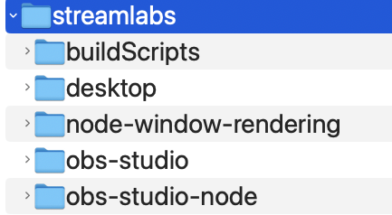

# Description

This project contains a collection of `bash` scripts that will build various streamlabs projects like streamlabs/obs-studio for Windows/Mac & install it in other projects.
Windows users likely want to run these scripts from _Git Bash_.

# How to use

Install this folder in the same directory right beside streamlabs-desktop, streamlabs-obs-studio, and streamlabs/obs-studio-node. This project contains `bash` scripts

```
root folder (ex., streamlabs folder)
-->slobs-buildScripts (this repo)
-->streamlabs/desktop
-->streamlabs/obs-studio (aka SLOBS)
-->streamlabs/obs-studio-node (aka OSN)
```



Download all of these repos from [github](https://github.com/streamlabs) first. Run `rebuild-slobs.sh` to build SLOBS. Next, run `rebuild-osn.sh` which will create a fake .app bundle for the automated tests. The advantage here it mimics what the
github workflow does. _Note_: Xcode currently defaults to Debug for OSN & SLOBS but the build scripts are configured for RelWithDebugInfo. Lastly, run `rebuild-desktop.sh`.

When you make changes to code, just hit _⌘+Shift+B_ (or CTRL+SHIFT+B on Windows) in Visual Studio Code to copy over the updated artifacts (behind the scenes this will run `update-everything-from-slobs.sh`). Sometimes drastic changes may require rebuild which means running `rebuild-osn.sh --clean`. This will trigger a complete rebuild of obs-studio-node causing it to redownload all deps. Grab a coffee this might take a few mins. Note- the local libobs_src folder will be replaced by the downloaded artifact (set by LibOBSVersion). You'll likely want to run `install-slobs.sh` to overwrite this with your local changes.

# Testing SLOBS changes in obs-studio-node

Run `update-everything-from-SLOBS.sh` script (via the _⌘+Shift+B_ hotkey combination) to build `streamlabs/obs-studio` & `obs-studio-node`. The resulting artifacts will be copied into `streamlabs/desktop`. Now when you execute the `yarn run test` command in OSN directory, it will utilize the latest compiled artifact. In addition, _desktop_ will also be updated.

# Environment variables

If you want to enable mac-virtual-cam on macOS 12.3+ you'll need to define the following environment variable `OBS_CODESIGN_TEAM` to enable automatic codesign in xcode.

# Build Desktop.app

If you just want to build the Streamlabs desktop.app then just run the following scripts:
`rebuild-desktop.sh` and `build-frontend-desktop-app.sh` scripts. Note: if the script fails to build the app you might need to run this command `yarn add electron-builder@23.6.0`. After the desktop app has been built into your dist folder, run the `run-local-arm64-desktop-app.sh` script. This script will prevent the updater from starting and attempt to download the preview.

# Future plan

Eventually, some of these scripts will likely get copied over into their respective repos where appropriate. But they will take a slightly different form in those repos so they can be ran via `yarn`.
